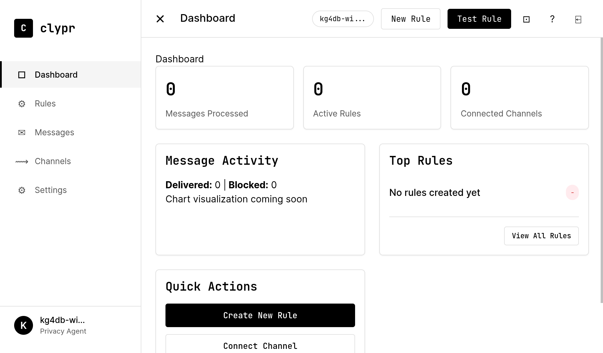

# Clypr - Decentralized Communication Privacy Relay

<!--  -->

## The Privacy Layer for Web3 Communications

Clypr is a programmable privacy gateway for Web3 messaging built on the Internet Computer Protocol (ICP). It enables users to control how dApps communicate with them through customizable privacy rules.

[](LICENSE)
[](https://internetcomputer.org/)
[](https://internetcomputer.org/)


## 🔍 What is Clypr?

Clypr is a programmable privacy gateway for Web3 messaging, built on the Internet Computer Protocol (ICP). It empowers users to control how decentralized applications (dApps) communicate with them, using customizable privacy rules and channel management. Clypr acts as a privacy layer between dApps and your real-world communication channels (email, SMS, etc.), ensuring your contact details remain private and only approved messages reach you.

## 🔐 Overview

In the Web3 ecosystem, users need greater control over how applications communicate with them. Clypr creates a privacy layer between decentralized applications and users' real-world communication channels. Instead of dApps sending messages directly to a user's email or phone, they send messages to the user's personal canister (privacy agent), which evaluates the messages against user-defined rules before forwarding approved messages via secure webhooks to the user's preferred channels.

```
dApp → User's Privacy Canister → Privacy Rules Evaluation → Webhook Bridge → Email/SMS delivery
```


## 🖼 Screenshots

### Dashboard


### Rules Page


### Create Rule Page


### Messages Page


### Channels Page


### Settings Page


## ✨ Key Features

- **Personal Privacy Agent**: Each user gets a dedicated canister that acts as their privacy gateway
- **Programmable Rules**: Define granular conditions for which messages get forwarded
- **Channel Management**: Control which messages go to which communication channels
- **AI-Powered Spam Detection**: Intelligent filtering using machine learning
- **dApp Integration**: Standard messaging protocol for Web3 applications
- **Privacy Preservation**: dApps never see users' actual contact information
- **Message Transformations**: Modify messages before delivery based on custom rules

## 🛠 Architecture

Clypr consists of four main components:

1. **dApp Message Interface**: Standardized protocol for sending messages to user canisters
2. **User Privacy Canister**: Personal agent that evaluates messages against rules
3. **AI Spam Detection System**: Machine learning-based filtering for unwanted communications
4. **Webhook Bridge Service**: Secure relay that delivers approved messages to external channels
5. **Admin Frontend**: User interface for managing privacy rules and preferences

## 🚀 Getting Started

### Prerequisites

- [DFINITY Canister SDK (dfx)](https://internetcomputer.org/docs/current/developer-docs/setup/install/) (latest version)
- Node.js 16+
- Yarn or npm
- ICP tokens and cycles (for mainnet deployment only)

### Local Development & Testing

1. Clone the repository
```bash
git clone https://github.com/abdushakurob/clypr.git
cd clypr
```

2. Install frontend dependencies
```bash
cd src/frontend
yarn install
```

3. Run the frontend in development mode
```bash
yarn dev
```

### Deploying to Internet Computer

#### Local Deployment

For testing on a local IC replica:

```bash
./deploy-ic.sh
```

This script will:
- Build the frontend with IC-specific configuration
- Start a local IC replica
- Create necessary canisters
- Deploy the frontend canister
- Display the local URL to access your app

#### Production Deployment (IC Mainnet)

To deploy to the Internet Computer mainnet:

1. Set up your identity and cycle wallet:
```bash
dfx identity new production
dfx identity use production
dfx wallet --network ic balance  # Check your cycle balance
```

2. Deploy to mainnet (requires cycles):
```bash
./deploy-ic-mainnet.sh
```

After deployment, your app will be accessible at `https://<canister-id>.icp0.io/`

<!-- ## 📚 Documentation

- [Product Requirements Document](docs/PRD.md)
- [Technical Architecture](docs/ARCHITECTURE.md)
- [Backend Architecture](docs/BACKEND_ARCHITECTURE.md)
- [AI Spam Detection System](docs/AI_SPAM_DETECTION.md)
- [API Reference](docs/API.md)
- [User Guide](docs/USER_GUIDE.md)
- [Developer Guide](docs/DEVELOPER_GUIDE.md)
- [Contributing Guide](docs/CONTRIBUTING.md)
- [Internet Computer Deployment Guide](docs/IC_DEPLOYMENT.md) -->

## 💡 Use Cases

- **Selective Notifications**: Only receive messages from trusted sources or high-priority alerts
- **Communication Consolidation**: Manage all Web3 communications in one place
- **Intelligent Spam Protection**: AI-powered filtering for sophisticated unwanted communications
- **Channel-Specific Routing**: Send urgent messages to SMS, regular updates to email
- **Privacy Protection**: Interact with dApps without exposing personal contact details
- **Adaptive Learning**: System improves filtering based on your preferences over time

## 🤝 Contributing

Contributions are welcome! Please feel free to submit a Pull Request. See our [Contributing Guide](docs/CONTRIBUTING.md) for more details.

## 📄 License

This project is licensed under the MIT License - see the [LICENSE](LICENSE) file for details.

## 🔗 Links

- [GitHub](https://github.com/abdushakurob/clypr)
- [Internet Computer](https://internetcomputer.org/)

## 🧩 Project Structure

```
clypr/
├── dfx.json              # Internet Computer canister configuration
├── deploy-ic.sh          # Local IC deployment script
├── deploy-ic-mainnet.sh  # Mainnet IC deployment script
├── src/
│   ├── frontend/         # React/TypeScript frontend application
│   │   ├── src/          # Application source code
│   │   ├── public/       # Static assets
│   │   └── vite.config.* # Vite configuration files
│   └── backend/          # Motoko backend canister
├── docs/                 # Project documentation
└── README.md             # This file
```

## ⚙️ Technical Details

- **Frontend**: React 18+, TypeScript, Vite
- **Backend**: Motoko canisters on Internet Computer
- **Deployment**: Internet Computer Protocol (local and mainnet)
- **Build System**: Vite with custom IC configuration
- **Authentication**: Internet Identity (planned)

